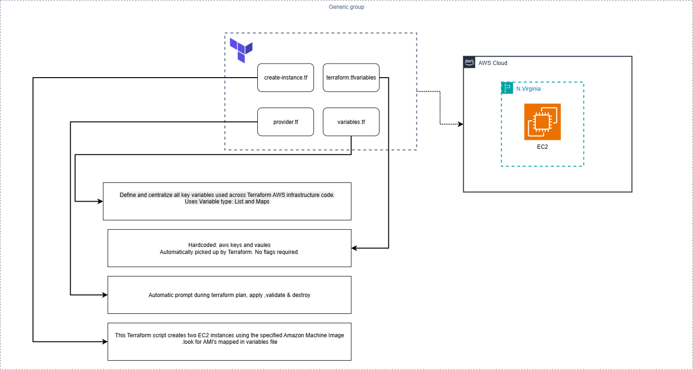
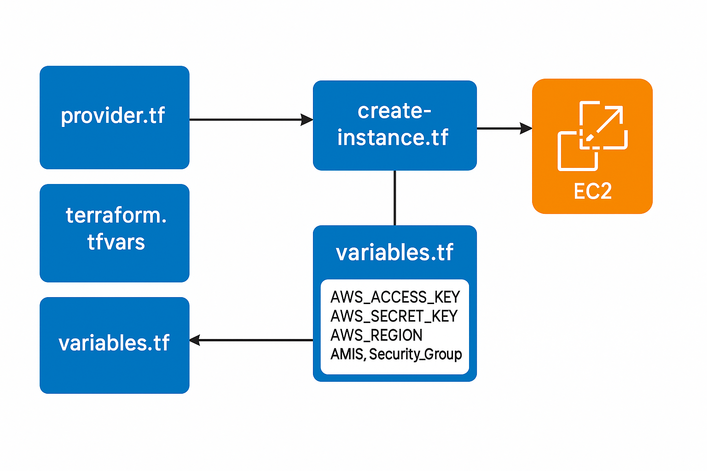

#  Deep Dive into Terraform Variables — Powering Reusable Cloud Infrastructure 
we focused on one of the most fundamental and powerful components of Infrastructure as Code:

## 🎯 Terraform Variables

Variables let us **parameterize configurations**, eliminate hardcoding, and support flexible multi-environment deployment.

---

## 📁 File Structure for Today's Project
```

├── create-instance.tf # EC2 instance provisioning logic
├── provider.tf # AWS provider setup with variables
├── terraform.tfvars # Actual values for secret/region inputs
└── variables.tf # All variable declarations and types
```





## 🧠 Types of Variables Used

| Variable Name       | Type   | Purpose                                |
|---------------------|--------|----------------------------------------|
| `AWS_ACCESS_KEY`    | string | AWS access credential (no default)     |
| `AWS_SECRET_KEY`    | string | AWS secret credential (no default)     |
| `AWS_REGION`        | string | Default AWS region                     |
| `Security_Group`    | list   | List of Security Group IDs             |
| `AMIS`              | map    | Maps region to corresponding AMI ID    |

---

## 📘 Key Concepts

### ✅ 1. **Declaring Variables** (`variables.tf`)

```hcl
variable "AWS_REGION" {
  default = "us-east-1"
}

variable "Security_Group" {
  type = list
  default = ["sg-24076", "sg-90890", "sg-456789"]
}

variable "AMIS" {
  type = map
  default = {
    us-east-1 = "ami-0f40c8f97004632f9"
    us-east-2 = "ami-05692172625678b4e"
  }
}
```
✅ 2. Using Variables in Resources (create-instance.tf)
```
resource "aws_instance" "MyFirstInstnace" {
  count         = 1
  ami           = lookup(var.AMIS, var.AWS_REGION)
  instance_type = "t2.micro"
  security_groups = var.Security_Group

  tags = {
    Name = "demoinstnce-${count.index}"
  }
}
```
Here, lookup() selects the correct AMI based on the region, and Security_Group is passed as a list.

✅ 3. Injecting Variables into the AWS Provider (provider.tf)
```
provider "aws" {
  access_key = var.AWS_ACCESS_KEY
  secret_key = var.AWS_SECRET_KEY
  region     = var.AWS_REGION
}
```
No hardcoding — fully modular and secure setup.

🔁 3 Ways to Configure Terraform Variables
| Method       | Example                                       | Use Case                     |
| ------------ | --------------------------------------------- | ---------------------------- |
| 1️⃣ CLI      | `terraform apply -var="AWS_REGION=us-west-2"` | Quick override               |
| 2️⃣ .tfvars  | Defined in `terraform.tfvars`                 | Reusable across environments |
| 3️⃣ Defaults | Defined in `variables.tf`                     | Base values for reuse        |


✅ Execution Steps
```
# Step 1: Initialize Terraform working directory
terraform init

# Step 2: Preview infrastructure changes
terraform plan

# Step 3: Apply the configuration
terraform apply
```

🔐 Set AWS Credentials (Locally)
Before running Terraform, export your AWS credentials:
```
export AWS_ACCESS_KEY_ID="your-access-key"
export AWS_SECRET_ACCESS_KEY="your-secret-key"
```
or
```
terraform apply -var="AWS_ACCESS_KEY=your-access-key" -var="AWS_SECRET_KEY=your-secret-key"
```


Terraform variables are the backbone of reusable, dynamic infrastructure.
By structuring them well, we unlock better automation, security, and environment scalability — a must for modern DevOps.
